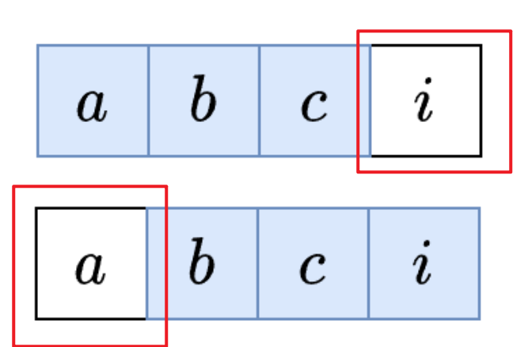

## 定长窗口

### 讲解

定长窗口即子数组、字串的长度固定。



定长的窗口，朴素办法是遍历每一个元素未开头对应的窗口，时间复杂度是 $O(nk)$。

**进阶**：定长窗口滑动的时候，**每次都是新进一个元素（右侧），踢出一个元素（左侧）**，那么可以根据这两个元素的增删对窗口的某种计数进行加减（根据题意自行设计 `check()`），进而将朴素的 $O(k)$ 遍历降低为 $O(1)$。

**代码**

```java
class Solution {
    public int maxVowels(String S, int k) {
        char[] s = S.toCharArray();
        int ans = 0;
        int vowel = 0;
        for (int i = 0; i < s.length; i++) {
            // 1. 窗口新增元素
            if (check(s[i])) { //进入的元素是否满足条件
                vowel++;
            }
            if (i < k - 1) { // 窗口大小不足 k
                continue;
            }
            // 2. 更新答案
            ans = Math.max(ans, vowel);
            // 3. 窗口踢出元素
            char out = s[i - k + 1];
            if (check(s[i])) { // 要被踢出的元素是否满足条件
                vowel--;
            }
        }
        return ans;
    }
}
```

**时间复杂度**：$O(n)$。

### 题单

[643. 子数组最大平均数 I - 力扣（LeetCode）](https://leetcode.cn/problems/maximum-average-subarray-i/)

[1456. 定长子串中元音的最大数目 - 力扣（LeetCode）](https://leetcode.cn/problems/maximum-number-of-vowels-in-a-substring-of-given-length/description/)

[1343. 大小为 K 且平均值大于等于阈值的子数组数目 - 力扣（LeetCode）](https://leetcode.cn/problems/number-of-sub-arrays-of-size-k-and-average-greater-than-or-equal-to-threshold/)

[2090. 半径为 k 的子数组平均值 - 力扣（LeetCode）](https://leetcode.cn/problems/k-radius-subarray-averages/)

[2379. 得到 K 个黑块的最少涂色次数 - 力扣（LeetCode）](https://leetcode.cn/problems/minimum-recolors-to-get-k-consecutive-black-blocks/description/)

[2841. 几乎唯一子数组的最大和 - 力扣（LeetCode）](https://leetcode.cn/problems/maximum-sum-of-almost-unique-subarray/description/)

[2461. 长度为 K 子数组中的最大和 - 力扣（LeetCode）](https://leetcode.cn/problems/maximum-sum-of-distinct-subarrays-with-length-k/description/)

[1423. 可获得的最大点数 - 力扣（LeetCode）](https://leetcode.cn/problems/maximum-points-you-can-obtain-from-cards/description/)

[1052. 爱生气的书店老板 - 力扣（LeetCode）](https://leetcode.cn/problems/grumpy-bookstore-owner/description/)

[1652. 拆炸弹 - 力扣（LeetCode）](https://leetcode.cn/problems/defuse-the-bomb/description/)

[3439. 重新安排会议得到最多空余时间 I - 力扣（LeetCode）](https://leetcode.cn/problems/reschedule-meetings-for-maximum-free-time-i/description/)

[2134. 最少交换次数来组合所有的 1 II - 力扣（LeetCode）](https://leetcode.cn/problems/minimum-swaps-to-group-all-1s-together-ii/description/)

[1297. 子串的最大出现次数 - 力扣（LeetCode）](https://leetcode.cn/problems/maximum-number-of-occurrences-of-a-substring/description/)

[2653. 滑动子数组的美丽值 - 力扣（LeetCode）](https://leetcode.cn/problems/sliding-subarray-beauty/description/)

[567. 字符串的排列 - 力扣（LeetCode）](https://leetcode.cn/problems/permutation-in-string/description/)

[438. 找到字符串中所有字母异位词 - 力扣（LeetCode）](https://leetcode.cn/problems/find-all-anagrams-in-a-string/description/)[438. 找到字符串中所有字母异位词 - 力扣（LeetCode）](https://leetcode.cn/problems/find-all-anagrams-in-a-string/description/)

[30. 串联所有单词的子串 - 力扣（LeetCode）](https://leetcode.cn/problems/substring-with-concatenation-of-all-words/description/):star:

[2156. 查找给定哈希值的子串 - 力扣（LeetCode）](https://leetcode.cn/problems/find-substring-with-given-hash-value/description/):star:

[1461. 检查一个字符串是否包含所有长度为 K 的二进制子串 - 力扣（LeetCode）](https://leetcode.cn/problems/check-if-a-string-contains-all-binary-codes-of-size-k/description/):star:

2156、1461 类似。

[2953. 统计完全子字符串 - 力扣（LeetCode）](https://leetcode.cn/problems/count-complete-substrings/description/) （待完成）

[2269. 找到一个数字的 K 美丽值 - 力扣（LeetCode）](https://leetcode.cn/problems/find-the-k-beauty-of-a-number/description/)

[1984. 学生分数的最小差值 - 力扣（LeetCode）](https://leetcode.cn/problems/minimum-difference-between-highest-and-lowest-of-k-scores/description/)

[220. 存在重复元素 III - 力扣（LeetCode）](https://leetcode.cn/problems/contains-duplicate-iii/description/)（待完成）:star:

[187. 重复的DNA序列 - 力扣（LeetCode）](https://leetcode.cn/problems/repeated-dna-sequences/description/)

[480. 滑动窗口中位数 - 力扣（LeetCode）](https://leetcode.cn/problems/sliding-window-median/description/)

## 不定长窗口

### 讲解

不定长窗口类型的题一般用来**求子数组**。

定长数组一般是**一层循环**，在遍历数组的时候更新统计数组，而不定长数组是**两层循环**，遍历数组的时候还要通过循环更新统计数组。

```java
for (int i = 0, j = 0; i < n; i ++ )
{
    while (j < i && check(i, j)) j ++ ;
    // 具体解题
}
```

### 题单

[3. 无重复字符的最长子串 - 力扣（LeetCode）](https://leetcode.cn/problems/longest-substring-without-repeating-characters/description/) :star2:

[1493. 删掉一个元素以后全为 1 的最长子数组 - 力扣（LeetCode）](https://leetcode.cn/problems/longest-subarray-of-1s-after-deleting-one-element/description/):star:

[1208. 尽可能使字符串相等 - 力扣（LeetCode）](https://leetcode.cn/problems/get-equal-substrings-within-budget/description/):star2:

[904. 水果成篮 - 力扣（LeetCode）](https://leetcode.cn/problems/fruit-into-baskets/description/)

[2024. 考试的最大困扰度 - 力扣（LeetCode）](https://leetcode.cn/problems/maximize-the-confusion-of-an-exam/description/)

[1004. 最大连续1的个数 III - 力扣（LeetCode）](https://leetcode.cn/problems/max-consecutive-ones-iii/description/)

[1658. 将 x 减到 0 的最小操作数 - 力扣（LeetCode）](https://leetcode.cn/problems/minimum-operations-to-reduce-x-to-zero/description/):star::star:

[2730. 找到最长的半重复子字符串 - 力扣（LeetCode）](https://leetcode.cn/problems/find-the-longest-semi-repetitive-substring/description/)

[2779. 数组的最大美丽值 - 力扣（LeetCode）](https://leetcode.cn/problems/maximum-beauty-of-an-array-after-applying-operation/description/)

[2537.统计好子数组的数目](https://leetcode.cn/problems/count-the-number-of-good-subarrays/description/) (待完成)


## 单序列

## 双序列

## 三指针

## 分组循环


