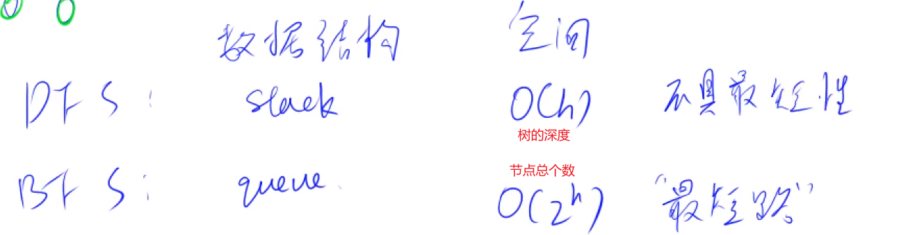

### 深搜——DFS

```c++
回溯：每次走完整个分支(走到叶子节点)，往回走，需要对已经标记过的点进行回溯，“恢复现场”。
剪枝：当枚举到某个节点时，发现已经无法实现目标，则直接进行回溯，“恢复现场”，不再向下枚举。// 排序是剪枝的前提
n皇后：
1、从左到右从上到下搜索：
int n;
bool row[N], col[N], dg[N * 2], udg[N * 2];
char g[N][N];

void dfs(int x, int y, int s)
{
    if (s > n) return;
    if (y == n) y = 0, x ++ ;

    if (x == n)
    {
        if (s == n)
        {
            for (int i = 0; i < n; i ++ ) puts(g[i]);
            puts("");
        }
        return;
    }

    g[x][y] = '.';
    dfs(x, y + 1, s);

    if (!row[x] && !col[y] && !dg[x + y] && !udg[x - y + n])
    {
        row[x] = col[y] = dg[x + y] = udg[x - y + n] = true;
        g[x][y] = 'Q';
        dfs(x, y + 1, s + 1);
        g[x][y] = '.';
        row[x] = col[y] = dg[x + y] = udg[x - y + n] = false;
    }
}
2、一行一行搜索：
void dfs(int u)
{
    if (u == n)
    {
        for (int i = 0; i < n; i ++ ) puts(g[i]);
        puts("");
        return;
    }

    for (int i = 0; i < n; i ++ )
        if (!col[i] && !dg[u + i] && !udg[n - u + i])
        {
            g[u][i] = 'Q';
            col[i] = dg[u + i] = udg[n - u + i] = true;
            dfs(u + 1);
            col[i] = dg[u + i] = udg[n - u + i] = false;
            g[u][i] = '.';
        }
}
//这里的u即可以当做 当前行 ，也可以当做当前放置了几个棋子。
```

### 宽搜——BFS

```c++
// 走迷宫  
typedef pair<int, int > PII;
int g[N][N], d[N][N];
int st[N][N];
int n, m;
int dx[] = {1, -1, 0, 0};
int dy[] = {0, 0, 1, -1};
PII pre[N][N]; // 

queue<PII> q;


void bfs() {
    q.push({0, 0});
    st[0][0] = 1;
    while(q.size()){
        int cnt = q.size();
        for (int i = 0; i < cnt; i ++) {
        auto tmp = q.front();
        q.pop();
        int x = tmp.first, y = tmp.second;
        if (x == n - 1 && y == m - 1) {
            cout << d[n - 1][m - 1];
            int x = n - 1, y = m - 1;
            while (x || y) {
                cout << x << ' ' << y << endl;
                x = pre[x][y].first;
                y = pre[x][y].second;
            }
            return ;
        }
        for(int i = 0; i < 4; i ++) {
            int xx = x + dx[i];
            int yy = y + dy[i];
            if(xx >= 0 && xx < n && yy >= 0 && yy < m &&!st[xx][yy] && g[xx][yy] == 0) {
                q.push({xx, yy});
                st[xx][yy] = 1;
                d[xx][yy] = d[x][y] + 1;
                pre[xx][yy] = tmp;
            }
        }
        }
    }
}
```


