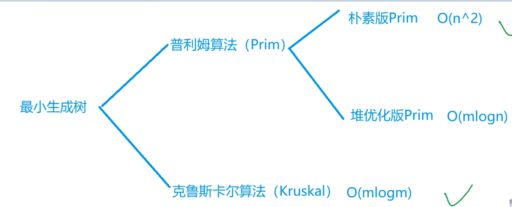

## 最小生成树



最小生成树**没有环**，边的**正负对最终结果无影响**，都是从小到大生成。

### Prim

以 **“点”**为基准，每次把距离当前最小生成树最近的点加入生成树中，然后用这个点去更新其他点到生成树的距离。

​	1.首先初始化dist为无穷大

​	2.一共循环n次(要把n个点全部加入到树中)

​	3.从1~n遍历，找到未在当前最小生成树中(st[i] = false)的距离生成树距离最小的点将其放入树中，更新st同时更新树边权重之和。

​	4.用这个点去更新其他点到生成树的最短距离(因为是以**点**为基准，所以每次都要用最后一个加入的点去更新其他点到树的距离，也		就是到这个点的距离)。

时间复杂度是 ``O(n2+m)``, n 表示点数，m 表示边数

```c++
int n;      // n表示点数
int g[N][N];        // 邻接矩阵，存储所有边
int dist[N];        // 存储其他点到当前最小生成树的距离
bool st[N];     // 存储每个点是否已经在生成树中


// 如果图不连通，则返回INF(值是0x3f3f3f3f), 否则返回最小生成树的树边权重之和
int prim()
{
    memset(dist, 0x3f, sizeof dist);

    int res = 0;
    for (int i = 0; i < n; i ++ )
    {
        int t = -1;
        for (int j = 1; j <= n; j ++ )
            if (!st[j] && (t == -1 || dist[t] > dist[j])) // 首先是点没被用过，其次是第一次选点或者是距离更小，不能先判断是不是第一次选点 这样的话每次i循环都是拿1与其他点比较
                t = j;
        if (i && dist[t] == INF) return INF; // i != 0 表明当前不是第一次选点，因为第一次选点时大家的dist都是无穷大，我就选1  然后用1更新，但是你后面再选点，距离已经更新过，如果选中的点还是无穷大，说明已经没有点可以加入树中，也就是无法生成最小生成树  即无解
        if (i) res += dist[t]; // 除了第一个点，后面的点加入树都要把权重加到答案中。此外：要先把选中点的权重加到最终答案中，因为这个点可能有自环(并且权重为负)，导致后面的更新用g[t][j]使其dist为负，但是这样更新是错的 所以先把dist加到答案中，这样后面即使更新了，但是因为st已经为true，就不会再考虑这个点了。
        st[t] = true;
        for (int j = 1; j <= n; j ++ ) dist[j] = min(dist[j], g[t][j]);
    }
    return res;
}
```

### `Kruskal` 算法

时间复杂度是 ``O(mlogm)``，n 表示点数，m 表示边数。

思路：

​	以 **“边权”**为基准，将各点之间的距离（边）进行排序(``O(mlogm)``)，每次选择距离最小的边将其放入最小生成树中，直到生成最终的树。

怎么判断当前边是否加入树中？

​	通过**检测边的两端点是否在同一个集合中**，采用**并查集**，把树中的节点都放入同一个集和。每添加一条边进去就计数++，最终一共	会计n - 1个，因为第一条边加入两个点，只计数+ 1，所以根据点是否等于n - 1来判断能否生成最小生成树。

```c++
int n, m;       // n是点数，m是边数
int p[N];       // 并查集的父节点数组

struct Edge     // 存储边
{
    int a, b, w;
    bool operator< (const Edge &W)const
    {
        return w < W.w;
    }
}edges[M];

int find(int x)     // 并查集核心操作
{
    if (p[x] != x) p[x] = find(p[x]);
    return p[x];
}

int kruskal()
{
    sort(edges, edges + m);
    for (int i = 1; i <= n; i ++ ) p[i] = i;    // 初始化并查集
    int res = 0, cnt = 0;
    for (int i = 0; i < m; i ++ )
    {
        int a = edges[i].a, b = edges[i].b, w = edges[i].w;
        a = find(a), b = find(b);
        if (a != b)     // 如果两个连通块不连通，则将这两个连通块合并
        {
            p[a] = b;
            res += w;
            cnt ++ ;
        }
    }
    if (cnt < n - 1) return INF;
    return res;
}
```