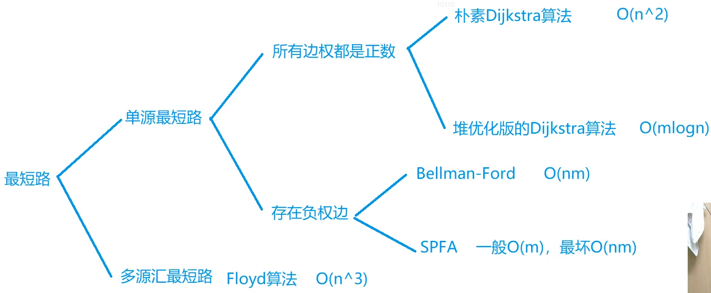

## 最短路

分析最短路：`n` 个点、`m` 条边。`n` 等于`1e5`的时候  时间复杂度要控制在`nlogn`或者线性。

### 迪杰斯特拉--Dijkstra

思路：采用贪心算法的策略，将所有顶点**分为已标记点和未标记点**两个集合，从起始点开始，**不断在未标记点中寻找距离起始点路径最短的顶点，并将其标记**，直到所有顶点都被标记为止。需要注意的一点是该方法**不能处理带有负权边的图**。

- **稠密图**

    采用邻接矩阵