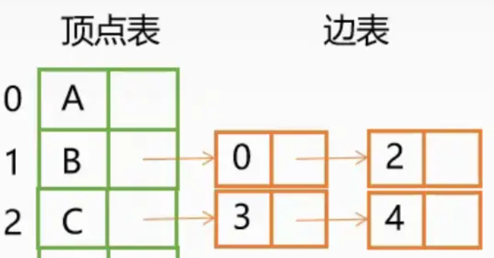
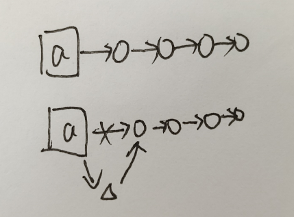

## 树和图的存储

```c++
// 树 是特殊的 图
// 图分为 有向图 和 无向图；对于无向图，用有向图来构造，两个节点之间用两条线路连接。
//十字链表法
const int N = 1e5 + 10, M = N * 2; // n节点数  m边数
int h[N], e[M], ne[M], idx; // h存储头结点 e存储头节点相连的节点 ne存储下一个节点的下标
bool st[N];//是否用过


初始化：memset(h, -1, sizeof h);// 注意初始化应该在建立边之前，因为要用到-1头结点

```

**建边**



建图的思想是用 `h[i]` 数组，采用**十字链表法**，顶点数组指向所有从他出发的边（无向图则变形成两条有向边）。

采用头插法，**核心思想**就是处理要指向的节点 `b`：



首先，idx作为指示符，指示的是当前 `b`，即：`e[idx]=b`；然后采用头插法，即当前节点 `b` 要指向的是 `a` 指向的第一个节点（头节点），所以：`ne[idx]=h[a]`；最后是 `b` 变成了头节点，所以 `h[a]` 数组要指向 `b`，（指向该节点的指示符）：`h[a]=idx ++`，同时 `idx` 加 `1` 用于下一个节点。 

`a` 节点是头节点，用 `h[a]` 就能取到。

```c++

void add(int a, int b) { // 头插法
    e[idx] = b;
    ne[idx] = h[a];
    h[a] = idx ++;
}
```


## 树的遍历

#### 1. 前序遍历

**递归注意要使用浅拷贝，即加引用（引用传递）**，不加引用是深拷贝（值传递）。
深拷贝：创建一个新空间来拷贝对象，改变副本不会改变原对象。直接重新创造了一个，所以是“深”。
浅拷贝：只是拷贝一下链接（指针），副本还是指向原对象。
**代码：递归**

```c++
class Solution {
public:
    vector<int> preorderTraversal(TreeNode* root) {
        vector<int> ans;
        preTraversal(root, ans);
        return ans;
    }
    void preTraversal(TreeNode * root, vector<int>& t) {
        if (!root)
            return ;
        t.push_back(root->val);
        preTraversal(root->left, t);
        preTraversal(root->right, t);
    }
};
```

**复杂度**

* 时间复杂度：$O(n)$，$n$ 为节点个数。
* 空间复杂度：$O(h)$，$h$ 为树的高度，即递归调用的栈空间。最坏的情况下树是一条链，这样的话 $h == n$。

迭代时因为用的是栈，后进先出，所有先把有儿子入栈，然后再把左儿子入栈，这样才能在下次先使用左儿子。
**代码：迭代**

```c++
class Solution {
public:
    vector<int> preorderTraversal(TreeNode* root) {
        vector<int> ans;
        if (!root)
            return ans;
        stack<TreeNode* > stk;
        stk.push(root);
        while (stk.size()) {
            auto t = stk.top();
            stk.pop();
            ans.push_back(t->val);
            if (t->right)
                stk.push(t->right); 
            if (t->left)
                stk.push(t->left);
        }
        return ans;
    }
};
```

**复杂度**

* 时间复杂度：$O(n)$。
* 空间复杂度：$O(n)$。

#### 2. 中序遍历

**法①递归**
中序遍历：`[左子树，根节点，右子树]`。
递归结束条件：遇到空节点。
按照中序递归即可：先递归左子树，然后是根节点，再是右子树。
注意要使用**引用传递**保存递归过程中遍历的每个节点。

```c++
class Solution {
public:
    vector<int> inorderTraversal(TreeNode* root) {
        vector<int> ans;
        inOrder(root, ans);
        return ans;
    }
    void inOrder(TreeNode *root, vector<int>& order) {
        if (!root)
            return;
        inOrder(root->left, order);
        order.push_back(root->val);
        inOrder(root->right, order);
    }
};
```

**复杂度**

* 时间复杂度：$O(n)$
* 空间复杂度：$O(n)$

**法②迭代**
递归调用就是利用系统栈作为存储空间，所以对应的迭代方法也选择`stack`来进行数据存储。
中序遍历：**左、根、右**。
栈的特点就是后进先出，刚好可以从根部遍历树的节点，先把左节点都存进去直到为空，这时栈顶节点刚好是最左的节点（即最左侧的叶子节点），将其出栈，先访问其左儿子（中序里的‘左’）：为空；继续访问其自身（中序里的‘根’）：不空，则把值存进结果；然后再判断右节点（中序里的‘右’）：将root置右，将其作为根节点去留给下一次判断；继续一直循环下去。
**注意**：循环结束的条件：栈为空并且节点为空。
**核心**：把每一个节点都作为根节点，先看其左儿子：有则加入队列，没有左儿子则其本身值存入结果，接着看右儿子，对右儿子也是看做‘根’，先看其右儿子的左儿子......一直循环下去。

```c++
class Solution {
public:
    vector<int> inorderTraversal(TreeNode* root) {
        stack<TreeNode* > s;
        vector<int> ans;
        if (!root)
            return ans;
        while (root || s.size()) {
            if (root) {
                s.push(root); // 因为栈是后进先出，所以先把父节点放进去，再后面在遍历的时候再把左儿子放进去，这样去的时候先取出来的才是左儿子，即遍历顺序里面的 左、根、右
                root = root->left;
            }
            else { // 左 已经空了（中序里的 左已经完成，接着就是 根），去除栈顶元素，即左的根 将元素值存入结果
                auto t = s.top();
                s.pop();
                ans.push_back(t->val); // 根的值存储完成 接着就是右侧节点了  所以root置右
                root = t->right;
            }
        }
        return ans;
    }
};
```

**复杂度**

* 时间复杂度：$O(n)$。
* 空间复杂度：$O(n)$。

#### 3. 后序遍历

**法① 递归**
后序遍历：`左、右、根`。

```c++
class Solution {
public:
    vector<int> postorderTraversal(TreeNode* root) {
        vector<int> ans;
        postOrder(root, ans);
        return ans;
    }

    void postOrder(TreeNode* root, vector<int>& v) {
        if (!root)
            return ;
        postOrder(root->left, v);
        postOrder(root->right, v);
        v.push_back(root->val);
    }
};
```

**复杂度**

* 时间复杂度：$O(n)$。
* 空间复杂度：$O(n)$。

**法② 迭代**
递归调用的就是栈空间，所以迭代的时候用栈来模拟递归调用即可。
**tip：** 在进行树的遍历的时候，如果根节点在最前面，那么迭代方法就比较好写，因为先遍历根节点直接将其值存储即可，不需要再回溯。
先分析后续遍历：左、右、根。$根节点$ 位于最后，我们可以先得到`根、右、左`这样的顺序，然后将得到结果翻转即可得到后续遍历。

```c++
class Solution {
public:
    vector<int> postorderTraversal(TreeNode* root) {
        stack<TreeNode* > stk;
        vector<int> ans;
        if (!root)
            return ans;
        stk.push(root);
        while (stk.size()) {
            auto t = stk.top();
            stk.pop();
            ans.push_back(t->val);
            if (t->left)
                stk.push(t->left); //根 右 左 因为栈后进先出 所以先存储左节点 后存储右节点  出栈的时候 右节点先出
            if (t->right)
                stk.push(t->right);
        }
        reverse(ans.begin(), ans.end());
        return ans;

    }
};
```

**复杂度**

* 时间复杂度：$O(n)$。
* 空间复杂度：$O(n)$。

## 拓扑排序

**核心思想**：每次要找的都是度数为 `0` 的点。

**有无环的判断**：
**没有环**的情况下，**出队和入队个数应该都为`n`**，当**次数不等于`n`时**，说明**有环**。

```c++
//初始化：
    1、节点的入度为0
    2、根据输入计算各节点的入度。
//思路：
    首先遍历全部节点，把入度为0的点加入队列，再遍历队列中所有点，把入度为0的点再加入队列并更新对应节点的入度(d[i]--)。
//有无环：
    没有环的情况下，出队和入队个数应该都为n，当次数不等于n时，说明有环。
//获取拓扑序：
	1、使用模拟数组，直接输出数组前n个元素即可。
    2、使用queue，重新建立一个拓扑序队列，每次节点出队之前把它放入拓扑序队列。
const int N = 1e5 + 10, M = 2 * N;
int h[N], e[M], ne[M], idx;
int n, m;
int q[N]; // 数组模拟队列
int d[N]; // 存储入度，初始化为0
queue<int> ans_q;  // 存储拓扑序列

void add(int a, int b) // 建图
{
    e[idx] = b;
    ne[idx] = h[a];
    h[a] = idx ++;
}

bool topsort()
{
    int hh = 0, tt = 0;
    for(int i = 1; i <= n; i++)
        if(!d[i])
            q[tt++] = i;
    while(hh != tt)
    {
        int tmp = q[hh++];
        for(int i = h[tmp]; i != -1; i = ne[i])
        {
            int t = e[i];
            d[t] --;
            if(!d[t])
                q[tt++] = t;
        }
    }
    return tt == n;
}
```

