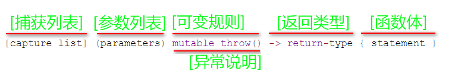

## 基础知识

### 1.数据类型

**int**					`-2,147,483,648 ~ 2,147,483,647    //2*1e9` 10位数

**long long**		`-9223372036854775808 ～ +9223372036854775807 // 9*1e19` 19位数

### 2.常用api

```c++
*max_element(num.begin(), num.end()); // 获取最大值   
*min_element(num.begin(), num.end()) ;// 获取最小值
sort(nums.begin(), nums.end()); // O(nlog(n))
// 带条件的排序
// 内联函数的形式
sort(nums.begin(), nums.end(), [] (type a, type b) int {});
// [capture] (parameters) -> return-type {body}
其中，type为nums中元素的类型
// 全局函数或者类里面静态函数 cmp
sort(nums.begin(), nums.end(), cmp);
count(nums.begin(), nums.end() , searchValue)  // 返回寻找的目标值的个数
```

### 3.常用函数

```c++
-----字符转数字-----
int atoi(const char* str) // 字符数组转整数
double atof(const char* str)  // 字符数组转浮点数
long long atoll(const char* str)  // 字符数组转数字
long atol(const char* str)  // 字符数组转数字
int rand() //不需要参数，它会返回一个从0到最大随机数的任意整数，最大随机数的大小通常是固定的一个大整数。
//如果要产生0~99这100个整数中的一个随机整数，可以表达为：int num = rand() % 100;
//如果要产生1~100，则是这样：int num = rand() % 100 + 1;  
-----字符串转数组-----
int stoi(string s) 
```

### 4.负数取模

```c++
// 负数取模
|小| % |大| = |小| 符号同前
|大| % |小| = |余| 符号同前
// 3%4 = 3 ； -3%4 = -3 ； -3%-4 = -3 ； 3%-4 = 3；
// 5%3 = 2 ； 5%-3 = 2 ；-5%-3 = -2 ； -5%3 = -2；
```

### 5.Lambda表达式

**样例**

```c++
1、sort自定义排序
std::sort(x, x + n,
    // Lambda expression
    [](float a, float b) {            
        return (std::abs(a) < std::abs(b));
    }
);
2、
auto function = [&](int i, int j)->int{ // 捕获列表  参数  返回值
    return i + j;
};
```

**Lambda表达式语法定义**



- **捕获列表**。在C++规范中也称为Lambda导入器， 捕获列表总是出现在Lambda函数的开始处。实际上，`[]`是Lambda引出符。编译器根据该引出符判断接下来的代码是否是Lambda函数，捕获列表能够捕捉上下文中的变量以供Lambda函数使用。

    - `[]`：不捕获任何变量；

    - `[val]`：**值传递**方式捕获变量；

        ```c++
        int num = 100, a = 10;
        auto function = ([num]{
                std::cout << num << std::endl; // 在里面调用 a 报错，因为没有传递值
            }
        );
        function(); // 100
        ```

    - `[=]`：表示值传递方式捕获**所有父作用域**的变量（包括`this`）；

        ```c++
        int index = 1;
        auto function = ([=]{
                    std::cout << "index: "<< index;
            }
        );
        function();  // 1
        ```

        

    - `[&var]`：表示**引用传递**捕捉变量`var`；

        ```c++
        int num = 100;
        auto function = ([&num]{
                num = 1000;
                cout << "num: " << num;
            }
        );
        function();
        ```

    - `[&]`：表示**引用传递方式捕捉所有父作用域**的变量（包括`this`）；

        ```c++
        int index = 1, num = 100;
        auto function = ([&]{
                num = 1000;index = 2;
                cout << index << ", " << num;
            }
        );
        function();
        ```

    - `[this]`：表示值传递方式捕捉当前的`this`指针；

    - `[=, &]`：拷贝与引用混合：

        1. `[=, &a, &b]`：表示以引用传递的方式捕捉变量`a`和`b`，以值传递方式捕捉**其它**所有变量。

        2. `[&, a, this]`：表示以值传递的方式捕捉变量`a`和`this`，引用传递方式捕捉**其它**所有变量。

            捕捉列表**不允许变量重复传递**。例如：

            `[=,a]`：这里已经以值传递方式捕捉了所有变量，但是重复捕捉`a`了，会报错；

            `[&,&this]`：这里`&`已经以引用传递方式捕捉了所有变量，再捕捉`this`也是一种重复。

            

- **参数列表**。与普通函数的参数列表一致。如果不需要参数传递，则可以连同括号“()”一起省略。

- **可变规格**。`mutable`修饰符， 默认情况下Lambda函数是const`函数，`mutable`可以取消其常量性。在**使用该修饰符时，参数列表不可省略（即使参数为空）。**

    - `mutable` 修饰符， 默认情况下Lambda函数是`const`函数，`mutable`可以取消其常量性。在使**用该修饰符时，参数列表不可省略（即使参数为空）**。

        ```c++
        int f()
        {
           int m = 0;
           int n = 0;
           [&, n] (int a) mutable { m = ++n + a; }(4);
           cout << m << endl << n << endl;
        }
        
        ```

        

- **异常说明**。用于Lamdba表达式内部函数抛出异常。**直接忽略**

- **返回类型**。 追踪返回类型形式声明函数的返回类型。在不需要返回值的时候可以连同符号 -> 一起省略。此外，在返回类型明确的情况下，也可以省略该部分，让编译器对返回类型进行推导。一般省略。

- **lambda函数体**。内容与普通函数一样，不过除了可以使用参数之外，还可以使用所有捕获的变量。
