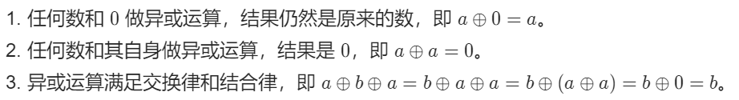

## 二进制、位运算 

### 1. 单一运算符

**注意：位运算优先级较低，一般要加括号**

**&**  **与运算符**

两个位都为1时，结果才为1。如 0010 **&** 1011 = 0010

**|**  **或运算符**

两个位都为0时，结果才为0。如 0010 **|** 1011 = 1011

**^**  **异或运算符**

同0异1。如 0010 **^** 1011 = 1001

**~**  **取反运算符**

0变1，1变0。~0 = 1，~1 = 0

### 2. 求一个数的二进制中第k位数值

```c++
n >> k & 1 // k 从0开始 表示n右移k位，& 1得到第k位的数值 (1 & 1 = 1，其余都得0 )
```

### 3. 返回n的二进制中的最后一位 1

```c++
lowbit(n) = n & -n

n = 10; // 二进制 1010 
lowbit(n) 返回整数2 即二进制 10
n = 12; //二进制 1100
lowbit(n) 返回整数4 即二进制 100
```

### 4. 异或运算  ^=  XOR



异或  ^ ：**同0异1**

```c++
8: 1000  1:0001  8^1 = 9  (1001)
对应的二进制相同位置上相同时得 0，不同得 1
```

### 5. 将数的二进制中的最后一位变为 0 

```c++
n & (n - 1); //其运算结果恰为把 n 的二进制位中的最低位的 1 变为 0 之后的结果。
```

**运用**

- 判断`int`类型数**是否为2的幂**

    只有当一个数的二进制表示里最高位为 `1`，其他位为 `0` 的时候才能是 `2` 的幂。

    `n & (n-1)` 操作可以将**最低位** `1` **变为** `0`，如果 `n&(n-1) == 0` 则说明 `n` 是 `2` 的幂，因为该操作是将最低位的 `1` 变成 `0`，现在 `n&(n-1)==0` 说明 `n` 的二进制表示中只有一个 `1` ，即 `n` 是 `2` 的幂。

- 一个数的二进制表示中有几个 `1`

    通过 `n&(n-1)` 操作每次将最低位的 `1` 变成 `0`，统计操作的次数即可。

- 一个数**是否为`4`的幂**

    一个数是 `4` 的幂，那么必然是 `2` 的幂，反之，则不然。那么首先确定条件 `n&n-1）== 0`，确定出该数是否为 `2`的幂。然后，`2` 的偶数次方减去 `1`，都能被3整除；而 `2` 的奇数次方的数减去 `1` 之后无法被3整除。得出 `4` 的幂的充要条件：`n > 0 && ((n&(n-1)) && (n-1) % 3==0`

### 6. bitset

```c++
1、bitset<n> b1;  // b有n位，被默认设置位0，n必须为常量表达式
2、bitset<n> b2(u);  // b是unsigned long long 的 低n位比特串拷贝，如果超出u的位数，剩余的被设置为0
3、string s = "100101";
   bitset<10> b3(s);　　//长度为10，前面用０补充
   char s2[] = "10101";
   bitset<13> b4(s2);　　//长度为13，前面用０补充
// 注意：上述两个构造函数，string或者字符指针必须只包含0、1字符。
4、访问：b1[0],b1[1]...
5、b.count();　　//5，count函数用来求bitset中1的位数
6、b.size();　　 //8，size函数用来求bitset的大小，一共有８位
7、b.test(0);　　//true，test函数用来查下标处的元素是０还是１，并返回false或true，此处foo[0]为１，返回true
8、b.any();　　//true，any函数检查bitset中是否有１
9、b.none();　　//false，none函数检查bitset中是否没有１
10、b.all();　　//false，all函数检查bitset中是全部为１
11、b.to_string(); // 转换为字符串
```

### 7. 位运算

**&**：按位与；**|**：按位或；**⊕**：按位异或；**~**：按位取反。

**怎样将集合和位运算集合起来**：

一个元素是否在集合中，可以用二进制的0、1来表示，0 表示不在集合中，1 表示在集合中。

#### 集合与集合之间的位运算

关于集合：

常见的集合运算：交集、并集、对称差、差、差（子集）、包含。

| 运算   | 集合表示 | 位运算表示 | 说明 |
| ------ | :------: | ---------- | ---- |
| 交集   | A ∩ B    | a & b | 交集是取二者共同元素，即二进制中两个对应元素必须都是 1 才行。 |
| 并集   | A ∪ B    | a \| b | 并集是取二者所有元素，即二进制中两个对应元素一个或多个是 1 即可。 |
| 对称差 | A Δ B    | a ⊕ b | 对称差指仅在其中一个集合的元素。即二进制中一个元素为 0、另一个元素为 1 的位置才能放到结果里，即同 0 异 1。 |
| 差     | A \ B    | a &~ b | 差：属于 A 但不属于 B 的元素，对应位运算的**先且在取反** |
|差（减去子集）|A \ B（B ⊆ A）|a ⊕ b|减去子集的差，对应于二进制中两个元素都为 1 的位置的匀速去掉，即 同 0 异 1，把同一位置元素相同的变为 0|
| 包含   | A ⊆ B    | a & b= a<br />a ∣ b=b | 包含即一个集合是另一个的子集：<br />a & b = a<br />a \| b = b（两种方式等价） |

#### 集合与元素之间

通常用到 **位移**。

**位移从第 0 位开始。**

|集合|位运算|举例|
|-|-|-|
|单元素集合：{i}|1<<i|{2}|
|全集：{0，1，2，3...n-1}|(1<<n)-1|{0，1，2，...n-1}|
|补集：$\mathrm {C_U^S}=U\setminus S$|~S||
|属于：$i\in\mathrm S$|(s >> *i*) & 1=1|(1101 >> 2) & 1=1（第2位元素为1，即属于）|
|不属于：$i\notin\mathrm S$|(s >> *i*) & 1=0|(1101 >> 1) & 1=0（第1位元素为0，即不属于）|
|添加元素：S ∪ {*i*}|s ∣ (1 << i)|1001 ∣ (1 << 2)=1101|
|删除元素：S ∖ {i}||1101 &∼ (1 << 2)|
|删除元素（一定在集合中）：|*S*∖{*i*}（i ∈ S）|1101 ⊕ (1 << 2)|
|删除最小元素：二进制中最右侧的 1|*s*&(*s*−1)|s = 101100  <br>s-1 = 101011 // 最低位的 1 变成 0，同时 1 右边的 0 都取反，变成 1<br>s&(s-1) = 101000|


[分享｜从集合论到位运算，常见位运算技巧分类总结！ - 力扣（LeetCode）](https://leetcode.cn/circle/discuss/CaOJ45/)
