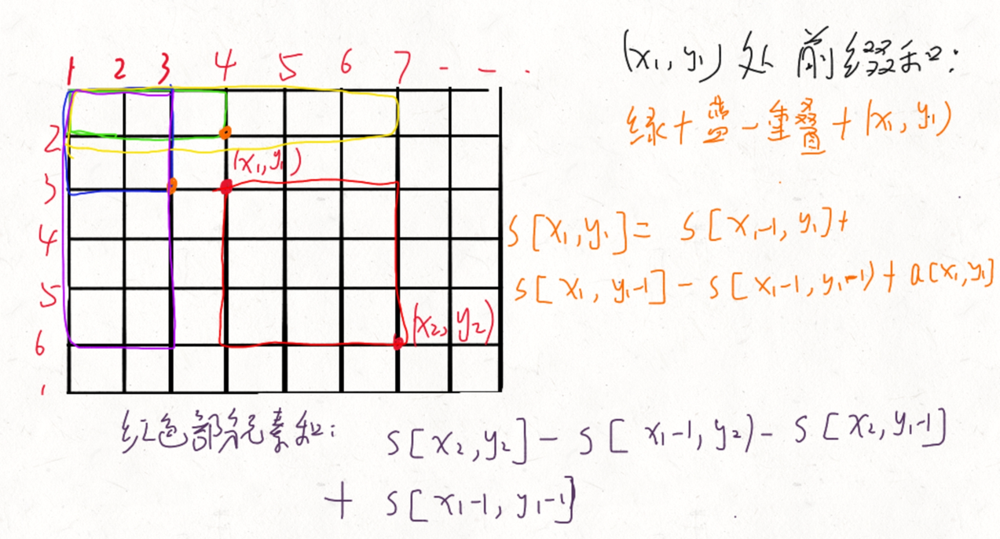
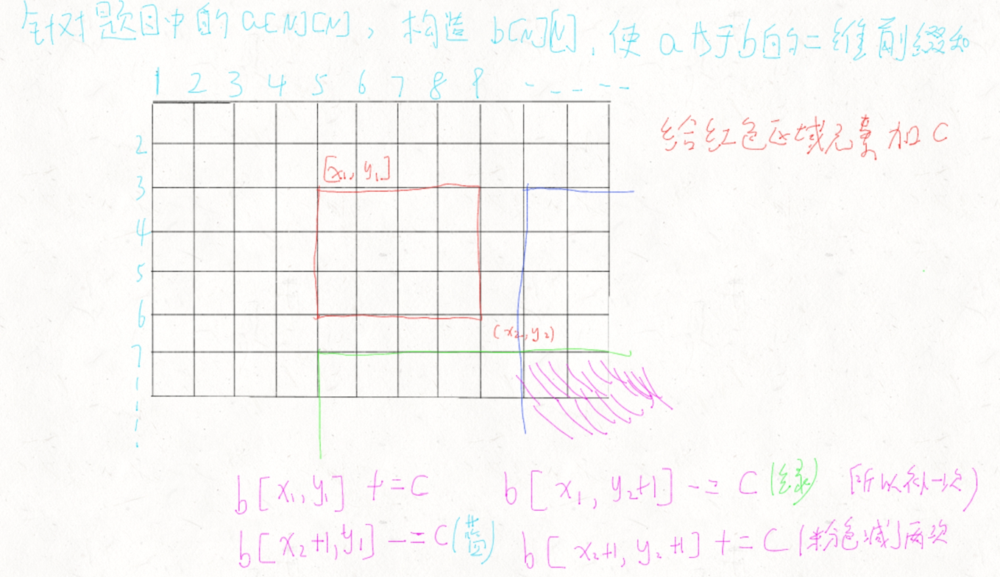

## 前缀和 与 差分

### 一维

```c++
int a[N], s[N];  
s[i] = a[1] + a[2] + ... a[i] //数组s[i]表示前i个元素和  下标从1开始
a[l] + ... + a[r] = s[r] - s[l - 1]  // l~r 某一段的元素和
```

### 二维

```c++
//i, j] = 第i行j列格子左上部分所有元素的和：
s[i, j] = s[i - 1, j] + s[i, j - 1] - s[i - 1, j - 1] + a[i][j]
//x1, y1)为左上角，(x2, y2)为右下角的子矩阵的和为：
s[x2, y2] - s[x1 - 1, y2] - s[x2, y1 - 1] + s[x1 - 1, y1 - 1]
```



### 一维差分

一种前缀和相对的策略，前缀和的逆运算

```c++
对于数组 a[1] a[2] a[3] ....
构造数组 b[1] b[2] b[3] ....
使得   a[i] = b[1] + b[2] + b[3] ... b[i] （a数组是b数组的前缀和）
即：
b[1] = a[1]
b[2] = a[2] - a[1]
b[3] = a[3] - a[2]
	 .
	 .
	 .
b[n] = a[n] - a[n - 1]
```

**用途**：  

给区间 `[l, r]` 中的每个数加上 `c`：

$$b[l] += c,\ \ \ b[r + 1] -= c$$


### 二维差分

```c++
针对输入的a[i][j]数组，构造b[i][j]数组使得a[i][j]为b的前缀和。
应用：
给以(x1, y1)为左上角，(x2, y2)为右下角的子矩阵中的所有元素加上c：
b[x1, y1] += c, b[x2 + 1, y1] -= c, b[x1, y2 + 1] -= c, b[x2 + 1, y2 + 1] += c
```



### 