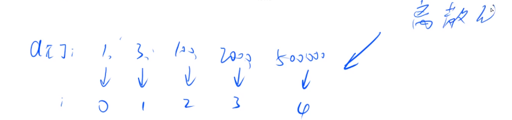

## 离散化



有序数组是稀疏数组，里面的值很大，但是个数很少，将其映射为下标0、1、2...的数组就是离散化。

1、a数组中有重复元素，所以要去重

2、计算出某个值x离散化后的值 （用二分）

```c++
vector<int> alls; //用于存储原本的数组下标（输入）
//去重
sort(alls.begin(), alls.end());
alls.erase(unique(alls.begin(), alls.end()), alls.end()); //得到的alls可以映射到原本的数组下标5

int a[N]; // 用当前的alls的下标存储稀疏数组的原本下标对应的值，此下标通过二分查找完成

int find(int x) {
    int l = 0, r = alls.size() - 1;
    while (l < r) {
        int mid = l + r >> 1;
        if(alls[mid] >= x)
            r = mid;
        else
         l = mid + 1;
    }
    return l;
    // return l + 1 让数组从1开始 求前缀和的时候就不用特殊处理
}
```

