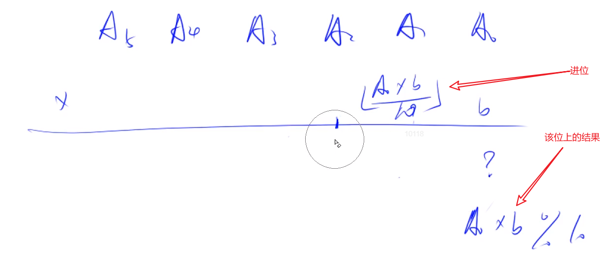
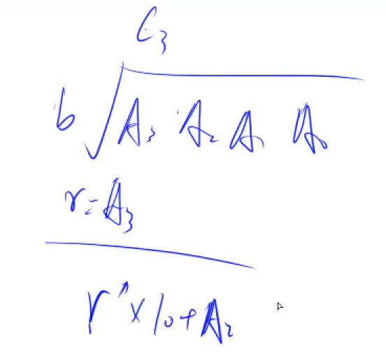

## 高精度加减乘除

### 高精度加法(大数相加)

```c++
vector<int> add(vector<int> &A, vector<int> &B) // A 得大于 B 即A的长度大于等于B
{
    if(A.size() < B.size())
        return add(B, A);
    vector<int> C;
    int t = 0;
    for(int i = 0; i < A.size(); i++)
    {
        t += A[i];
        if(i < B.size())
            t += B[i];
        C.push_back(t % 10);
        t /= 10;
    }
    if(t)
        C.push_back(t);
    reverse(C.begin(), C.end());
    return C;
}
```

### 高精度减法(大数相减)

```c++
//cmp函数判断A、B大小
bool cmp(vector<int> A, vector<int> B)
{
    if(A.size() != B.size())
        return A.size() > B.size();
    for(int i = A.size() - 1; i >= 0; i --)
        if(A[i] != B[i])
            return A[i] > B[i];
    return true;
}
// C = A - B, 满足A >= B, A >= 0, B >= 0
vector<int> sub(vector<int> &A, vector<int> &B) A与B是从左到右为低位到高位
{
    vector<int> C;
    int t = 0;
    for(int i = 0; i < A.size(); i ++)
    {
        t = A[i] - t;
        if(i < B.size())
            t -= B[i];
        C.push_back((t + 10) % 10);// 将t大于0与小于0的情况合二为一
        if(t < 0)
            t = 1;
        else
            t = 0;
    }
    while(C.size() > 1 && C.back() == 0)
        C.pop_back(); // 去除前导0 
        return C;
}
```

### 高精度乘低精度



```c++
// C = A * b, A >= 0, b >= 0 A从左到右为低位到高位
vector<int> mul(vector<int> &A, int b)
{
    vector<int> C;
    int t = 0;
    for(int i = 0; i < A.size() || t; i ++)
    {
        if(i < A.size())
            t += A[i] * b;
        C.push_back(t % 10);
        t /= 10;
    }
    //结果为0 的情况 比如1111 * 0  = 0 需要删除前导0
    while(C.size() > 1 && C.back() == 0) 
        C.pop_back();
    return C;
}
```

### 高精度除以低精度



```c++
// A / b = C ... r, A >= 0, b > 0  A从左到右为低位到高位
vector<int> div(vector<int> &A, int b, int &r)
{
    int t = 0;
    vector<int>C;
    for(int i = A.size() - 1; i >= 0; i --)
    {
        t = t * 10 + A[i];
        C.push_back(t / b);
        t = t % b;
    }
    r = t;
    reverse(C.begin(), C.end()); // C从左到右为高位到地位 当除数可能比较大时会有前导0
    while(C.size() > 1 && C.back() == 0)
        C.pop_back();
    return C;
}
```

