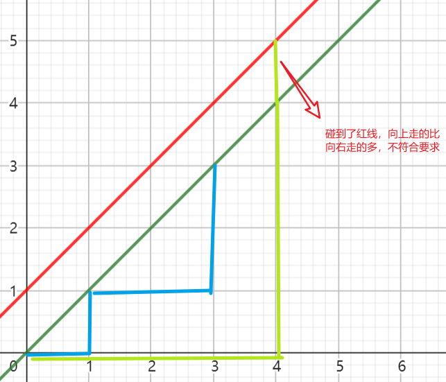
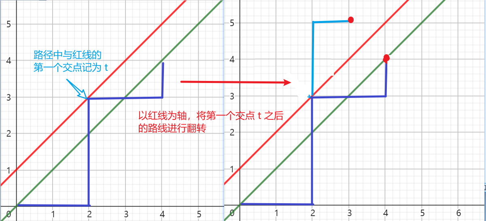
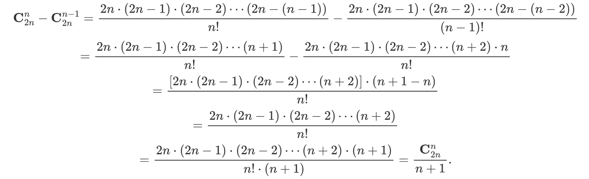

## 卡特兰数

### 定义

**卡特兰数**是一种经典的组合数，经常出现在各种计算中，其前几项为 : 1, 2, 5, 14, 42, 132, 429, 1430, 4862, 16796, 58786, 208012, 742900, 2674440, 9694845, 35357670, 129644790, 477638700, 1767263190, 6564120420, 24466267020。。。。。。

**问题定义**：用 `n` 个 `0`、`1` 组成长度为`2n` 的 `01` 序列，保证组成的序列的任意前缀中 `0` 的个数都不少于（大于或者等于）`1` 的个数，问能组成多少个这样的系列。

### 计算

**通项公式**：$\Large \frac{\mathbf C^n_{2n}}{n+1}$。

**递推公式**：$f(n)=\frac{4n-2}{n-1}\cdot f(n-1)$。

**递归公式**：$f(n)=f(0)*f(n-1)+f(1)*f(n-2)+f(2)*f(n-3)+...+f(n-1)*f(0)$。

通项公式推导：求卡特兰数可以转化为一个等价问题：在一个二维平面内，从 `(0, 0)` 出发到达 `(n, n)`，每次可以**向上或者向右**走一格，`0` 代表**向右**走一格，`1` 代表**向上**走一格，即每条路径都会代表一个 `01` 序列，则满足任意**前缀中0的个数不少于1的个数**序列对应的路径为右下侧（下半三角），如下图：



因为`0`的个数不能少于`1`，因此向右走的步数应该始终大于等于向上走的步数，即符合要求的路线必须**严格在图中红色线的下面**（**不可以碰到红线**，**可以碰到绿线**）。

考虑一个非法路径：



因为`0、1`的个数都是`n`个，所以最终终点的位置一定是 `(n,n)`，根据组合数，向上向右的次数各 `n`个，即在 `2n` 中挑选 `n` 个，即**到达终点的总方案数**为：$\mathbf{C}^n_{2n}$。因为终点都是`(n,n)`，对于任何**经过或者穿过红色线的非法路径，将其以红色线为轴进行翻转后，终点都会落到**`(n-1,n+1)`，也就说非法路径等效于到达点 `(n-1,n+1)` 的路径数。根据组合数，在`2n`中挑选 `n-1` 个或者 `n+1`个，**不合法路径总方案数**为：$\mathbf{C}^{n-1}\_{2n}=\mathbf{C}^{n+1}\_{2n}$。则**合法路径数**为 

```latex
\mathbf{C}^n_{2n}-\mathbf{C}^{n-1}_{2n}=\frac{2n\cdot(2n-1)\cdot(2n-2)\cdots(2n-(n-1))}{n!}-\frac{2n\cdot(2n-1)\cdot(2n-2)\cdots(2n-(n-2))}{(n-1)!}\\ =\frac{2n\cdot(2n-1)\cdot(2n-2)\cdots(n+1)}{n!}-\frac{2n\cdot(2n-1)\cdot(2n-2)\cdots(n+2)\cdot{n}}{n!}\\ =\frac{[{2n\cdot(2n-1)\cdot(2n-2)\cdots(n+2)}]\cdot(n+1-n)}{n!}\\ =\frac{{2n\cdot(2n-1)\cdot(2n-2)\cdots(n+2)}}{n!}\\ =\frac{{2n\cdot(2n-1)\cdot(2n-2)\cdots(n+2)\cdot{(n+1)}}}{n!\cdot (n+1)}=\frac{\mathbf{C}^n_{2n}}{n+1}
```




### 相似问题

#### **括号问题** 

`n` 个左括号，`n` 个右括号，问有多少个长度为 `2n` 的括号序列使得所有的括号都是合法的。

#### 312排列

一个长度为 `n` 的排列 `a`，只要满足 $i<j<k$ 且 $a_j<a_k<a_i$，这个排列就称为312排列。求 `n` 中全排列中不是312排列得排列个数。

